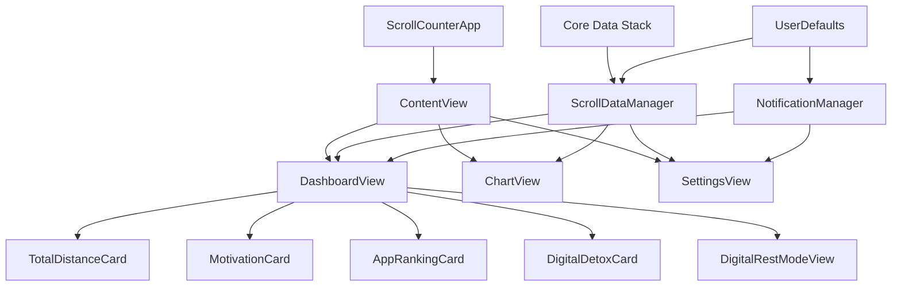

# アプリアーキテクチャ仕様書

## システム概要

スクロールチェッカーは、iOSのアクセシビリティAPIを活用してスクロール活動を監視し、デジタルウェルビーイングを促進するiOSアプリケーションです。

## アーキテクチャ構成

### 🏗️ 全体設計パターン
```
MVVM (Model-View-ViewModel) + ObservableObject
├── View Layer (SwiftUI)
├── ViewModel Layer (@ObservableObject)
├── Model Layer (Core Data + Business Logic)
└── Service Layer (Notification, Storage)
```

### 📱 主要コンポーネント構成



## データアーキテクチャ

### 🗄️ Core Data 設計

#### ScrollDataEntity
```swift
@Entity ScrollDataEntity {
    @Attribute var date: Date          // 記録日時
    @Attribute var totalDistance: Double    // 総スクロール距離
    @Attribute var appName: String?     // アプリ名（オプション）
    @Attribute var sessionDistance: Double  // セッション距離
    @Attribute var timestamp: Date     // タイムスタンプ
}
```

#### データフロー
```
スクロール検知 → ScrollDataManager → Core Data → UI更新
                      ↓
                UserDefaults (設定・履歴)
                      ↓
                NotificationManager (通知)
```

### 💾 永続化戦略

#### Core Data（メインデータ）
```swift
用途: スクロール履歴、アプリ別統計
スキーマ: ScrollData.xcdatamodeld
場所: アプリコンテナ内
バックアップ: iCloud同期対応（将来）
```

#### UserDefaults（設定・状態）
```swift
保存内容:
- isNotificationEnabled: Bool
- detoxNotificationsEnabled: Bool  
- notificationTime: Date
- appStartDate: Date
- firstLaunchFlag: Bool
```

## 状態管理設計

### 🔄 ObservableObject パターン

#### ScrollDataManager
```swift
@MainActor
class ScrollDataManager: ObservableObject {
    @Published var todayTotalDistance: Double = 0
    @Published var yesterdayTotalDistance: Double = 0
    @Published var topApps: [AppScrollData] = []
    @Published var allTimeTopApps: [AppScrollData] = []
    @Published var weeklyData: [DailyScrollData] = []
    @Published var isMonitoring: Bool = false
}
```

#### NotificationManager
```swift
@MainActor  
class NotificationManager: ObservableObject {
    @Published var hasPermission = false
    @Published var isNotificationEnabled = true
    @Published var detoxNotificationsEnabled = true
    @Published var notificationTime = Date()
}
```

### 📡 データバインディング
```swift
// View ↔ ViewModel の双方向バインディング
@EnvironmentObject var scrollDataManager: ScrollDataManager
@EnvironmentObject var notificationManager: NotificationManager

// 自動UI更新
@Published プロパティ変更 → SwiftUI自動再描画
```

## 機能モジュール設計

### 📊 スクロール検知・計測モジュール

#### 責務
```
✅ アクセシビリティAPIからのスクロールイベント取得
✅ 距離計算とデータ正規化
✅ アプリ別使用統計の分離・集計
✅ リアルタイムデータ更新
```

#### 実装
```swift
// 疑似コード
func detectScrollEvent() {
    NotificationCenter.post("ScrollDetected", distance: calculatedDistance)
}

func updateScrollData(distance: Double, appName: String) {
    todayTotalDistance += distance
    updateAppSpecificData(appName, distance)
    saveToCore data()
    notifyUI()
}
```

### 🔔 通知管理モジュール

#### 責務
```
✅ 毎日定時のデトックス促進通知
✅ 過度使用時の警告通知
✅ 通知権限管理
✅ カスタマイズ設定の反映
```

#### 通知戦略
```swift
// 段階的通知システム
Level 1 (1km+): 軽い注意喚起
Level 2 (5km+): 休憩促進
Level 3 (10km+): 緊急警告
```

### 📈 データ可視化モジュール

#### Chart実装
```swift
// Swift Charts使用
import Charts

struct WeeklyScrollChart: View {
    var data: [DailyScrollData]
    
    var body: some View {
        Chart(data, id: \.date) { item in
            BarMark(
                x: .value("日", item.date),
                y: .value("距離", item.totalDistance)
            )
        }
    }
}
```

## セキュリティ・プライバシー設計

### 🔒 データ保護

#### ローカル専用ポリシー
```
✅ 全データはデバイス内にのみ保存
✅ 外部サーバーへの送信なし
✅ ネットワーク通信最小限（通知のみ）
✅ 暗号化対応（Core Data）
```

#### アクセス権限管理
```swift
必要権限:
- アクセシビリティ: スクロール検知用
- 通知: リマインダー用
- 画面制御: デジタル休憩モード用

不要権限:
- 位置情報 ❌
- カメラ・マイク ❌ 
- 連絡先 ❌
- カレンダー ❌
```

### 🛡️ プライバシー By Design

#### データ最小化
```swift
収集データ: スクロール距離のみ
保持期間: 7日間（チャート表示用）
匿名化: 個人識別情報なし
```

## パフォーマンス設計

### ⚡ 最適化戦略

#### メモリ管理
```swift
// バックグラウンド処理
DispatchQueue.global(qos: .background).async {
    // 重い処理
    DispatchQueue.main.async {
        // UI更新
    }
}

// メモリ効率
@State private var timer: Timer?
deinit { timer?.invalidate() }
```

#### データベース最適化
```swift
// Core Data最適化
- Lazy Loading: 必要時のみデータ読み込み
- Batch Processing: 大量データの効率処理
- Indexing: 日付・アプリ名でのインデックス
- Pruning: 古いデータの自動削除
```

### 📱 レスポンシブ設計

#### デバイス対応
```swift
画面サイズ: iPhone SE 〜 iPhone 15 Pro Max
解像度: 適応レイアウト（Auto Layout）
ダークモード: 完全対応
アクセシビリティ: VoiceOver対応
```

## テスト戦略

### 🧪 テスト構成

#### Unit Tests
```swift
- ScrollDataManager: データ計算ロジック
- NotificationManager: 通知スケジューリング
- ConversionLogic: 距離換算アルゴリズム
- DateFormatting: 日付処理ユーティリティ
```

#### Integration Tests
```swift
- Core Data Stack: データ永続化
- Notification Flow: 通知エンドツーエンド
- UI Data Binding: ViewModel ↔ View連携
```

#### UI Tests
```swift
- Navigation Flow: タブ間移動
- Settings Configuration: 設定変更
- Rest Mode Activation: デトックスモード
```

### 🎯 テストデータ戦略
```swift
Mock Data:
- 様々なスクロール距離パターン
- 週間データの生成
- アプリ別使用統計
- 通知タイミングテスト
```

## デプロイメント設計

### 📦 ビルド構成

#### Development
```swift
Bundle ID: com.example.scrollcounter.dev
Provisioning: Development Certificate
Debug: Enabled
Analytics: Disabled
```

#### Release
```swift
Bundle ID: com.example.scrollcounter
Provisioning: Distribution Certificate  
Debug: Disabled
Analytics: Enabled (匿名)
Optimization: Enabled
```

### 🚀 配信戦略

#### App Store配信
```
最小iOS: 17.0
カテゴリ: ヘルスケア・フィットネス
年齢制限: 4+（全年齢対象）
App Store Keywords: デジタルデトックス, ウェルビーイング, スクロール
```

## 今後の拡張設計

### Phase 2: ウィジェット対応
```swift
- ホーム画面ウィジェット
- 今日のスクロール距離表示
- ロック画面対応（iOS 16+）
```

### Phase 3: Apple Watch連携
```swift
- 休憩リマインダー
- クイック統計表示
- ヘルスケアアプリ連携
```

### Phase 4: AI機能
```swift
- 使用パターン学習
- 個人最適化された提案
- 予防的デトックス提案
```

---

## 更新履歴

| バージョン | 日付 | 変更内容 |
|------------|------|----------|
| 1.0.0 | 2025-08-31 | 初版アーキテクチャ設計 |
