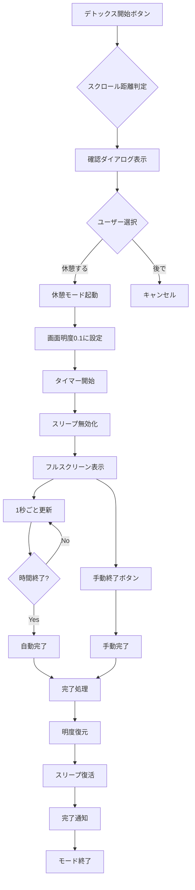

# デジタル休憩モード仕様書

## 概要

デジタル休憩モードは、ユーザーの過度なスクロール使用を検知し、健康的な休憩を促進するフルスクリーン機能です。iOSのセキュリティ制限内で、デバイススリープに最も近い体験を提供します。

## 機能仕様

### 🎯 起動条件とインテリジェント提案

| スクロール距離 | 推奨休憩時間 | 警告レベル | メッセージ内容 |
|----------------|--------------|------------|----------------|
| **10km以上** | **30分** | 🚨 緊急 | 本格的なデトックスで目と体を回復させましょう |
| **5km以上** | **20分** | ⏰ 重要 | 散歩、読書、瞑想などをお試しください |
| **1km以上** | **10分** | 📱 注意 | 20-20-20ルールを実践してみませんか？ |
| **1km未満** | **5分** | 😊 予防 | 軽い休憩で、この調子をキープしましょう |

### 🌙 技術実装仕様

#### 画面制御
```swift
// 明度制御仕様
起動時: UIScreen.main.brightness = 0.1  // 10%まで暗化
終了時: 元の明度に0.5秒かけて復元
保存値: originalBrightness (起動時に保存)
```

#### タイマー機能
```swift
// タイマー仕様
更新間隔: 1.0秒
表示形式: MM:SS (例: 25:30)
自動終了: timeRemaining = 0 で完了処理
手動終了: "休憩を終了"ボタンで即座終了
```

#### スリープ防止
```swift
// デバイススリープ制御
起動時: UIApplication.shared.isIdleTimerDisabled = true
終了時: UIApplication.shared.isIdleTimerDisabled = false
目的: 休憩中の意図しない中断防止
```

### 🎨 UI/UX 仕様

#### 画面構成
```
┌─────────────────────────────┐
│        🍃 (80pt)            │  ← デトックスアイコン
│                             │
│      デジタル休憩中          │  ← タイトル (.title)
│                             │
│        25:30                │  ← カウントダウン (48pt)
│                             │
│   目を休めて、深呼吸を...    │  ← メッセージ (.headline)
│                             │
│  👀 遠くを見つめる          │  ← 休憩アドバイス
│  🧘‍♀️ 軽いストレッチ        │
│  💧 水分補給               │
│                             │
│     [休憩を終了]            │  ← 早期終了ボタン
│   推奨休憩時間: 20分        │  ← 時間表示
└─────────────────────────────┘
```

#### カラーパレット
```swift
背景色: Color.black (完全な黒)
アクセント: Color.green (自然・健康イメージ)
テキスト: Color.white.opacity(0.9) (メイン)
         Color.white.opacity(0.7) (サブ)
         Color.white.opacity(0.5) (補助)
警告色: Color.orange (早期終了ボタン)
```

### 🔄 動作フロー



### 📱 完了処理仕様

#### 自動完了時
```swift
タイトル: "休憩完了！🎉"
メッセージ: "お疲れさまでした。\n引き続き健康的なデジタルライフを心がけましょう。"
ボタン: "OK" (.default)
```

#### 手動完了時
```swift
処理: 即座にrestoreBrightness()実行
通知: 完了メッセージは表示しない
明度: 0.5秒遅延で復元
```

### 🛡️ エラーハンドリング

#### 明度制御失敗
```swift
// フォールバック処理
if UIScreen.main.brightness設定失敗 {
    // UI表示は継続（明度変更なし）
    // ログ出力で問題を記録
    print("Brightness control failed")
}
```

#### タイマー異常終了
```swift
// メモリリーク防止
deinit {
    timer?.invalidate()
    restoreBrightness()
    UIApplication.shared.isIdleTimerDisabled = false
}
```

### 🔒 セキュリティ・プライバシー考慮

#### iOS制限の遵守
- ✅ システムレベルのスリープ制御は使用しない
- ✅ ユーザーの明示的な操作でのみ起動
- ✅ 緊急時（電話等）の通常受信を阻害しない

#### ユーザー制御
- ✅ いつでも手動終了可能
- ✅ 推奨時間の表示（強制ではない）
- ✅ バックグラウンド移行時の適切な処理

### 🎯 期待される効果

#### 健康面
- 👀 眼精疲労の軽減
- 🦴 首・肩こりの予防
- 🧠 デジタル疲労の回復
- 💧 適切な水分補給の促進

#### 行動変容
- ⏰ 定期的な休憩習慣の形成
- 🌿 デジタルデトックス意識の向上
- 📱 適度なデバイス使用の促進
- 🧘‍♀️ マインドフルネスの実践

### 📊 実装メトリクス

#### パフォーマンス
```
起動時間: < 0.5秒
明度変更: < 0.1秒
タイマー精度: ±0.1秒
メモリ使用: < 5MB追加
```

#### 互換性
```
最小iOS: 17.0
対応デバイス: iPhone全機種
画面サイズ: 適応レイアウト
ダークモード: 強制適用
```

---

## 更新履歴

| バージョン | 日付 | 変更内容 |
|------------|------|----------|
| 1.0.0 | 2025-08-31 | 初版作成、基本機能実装 |
